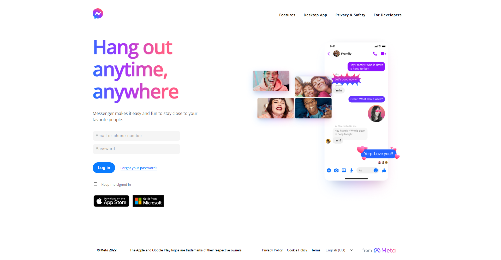
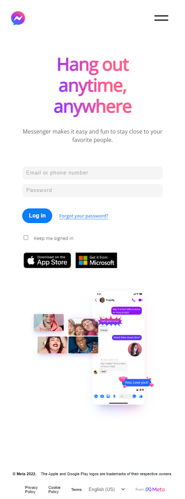
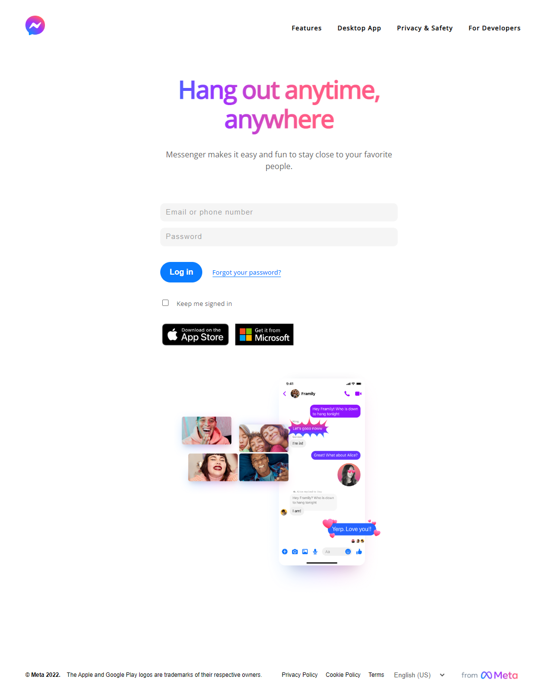

# <strong>
Messenger Login
</strong>

 

## **Preview in Tablet and Mobile screen**

   
   

  

---

## **Built using:**

## **Link**

- [Live page](https://messenger-login.vercel.app/)

<a href='#top'>(Back to top)</a>

 
